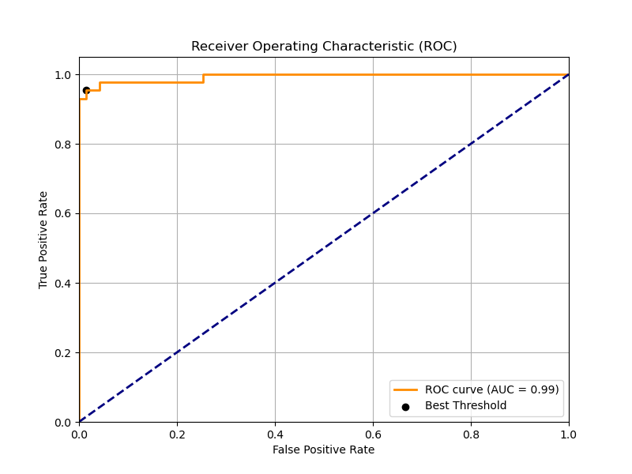
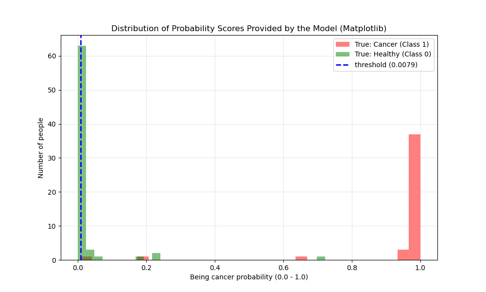
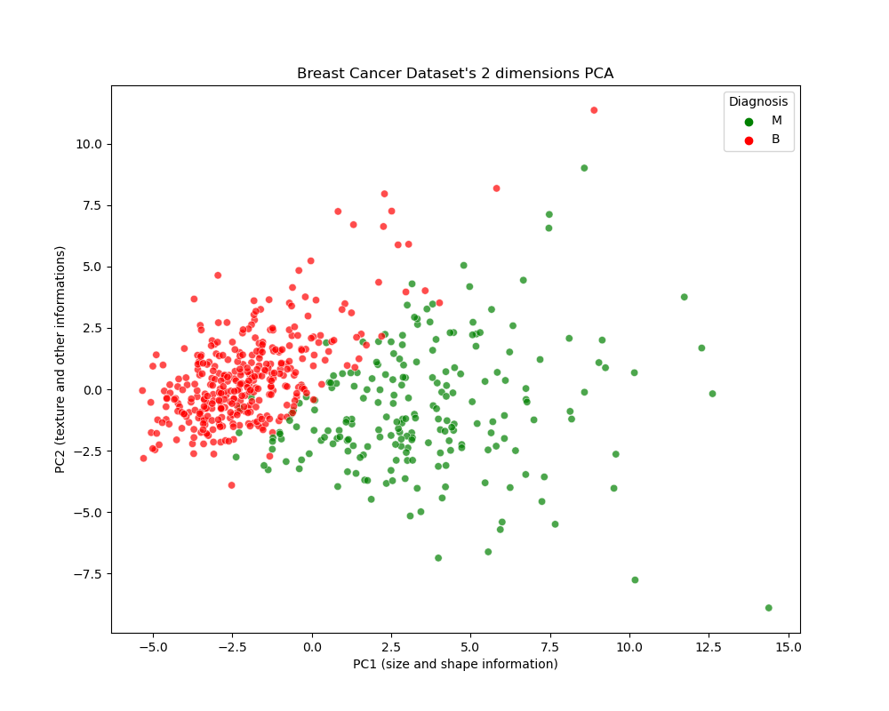

# 🎗️ Breast Cancer Diagnosis: A Safety-First Approach


## 📌 Project Overview
This project classifies breast cancer tumors as **Malignant (M)** or **Benign (B)** using the Breast Cancer Wisconsin (Diagnostic) Dataset.

However, this is **not** a standard classification project. 

The primary goal was not to achieve the highest "Accuracy" score, but to eliminate **False Negatives (Type II Errors)**. In oncology, telling a cancer patient they are healthy is a fatal mistake. Therefore, this project implements a custom **"Safety Threshold Tuning"** strategy to prioritize patient safety above all else.

---

## 📂 Dataset
The dataset is included in this repository at `data/data.csv` for easy reproduction.

* **Original Source:** [Breast Cancer Wisconsin (Diagnostic) Data Set](https://www.kaggle.com/uciml/breast-cancer-wisconsin-data)
* **Attributes:** The dataset contains features computed from a digitized image of a fine needle aspirate (FNA) of a breast mass (e.g., radius, texture, perimeter).

## ⚠️ The Challenge: Why 97% Accuracy Wasn't Enough
During the initial modeling phase using **XGBoost**, the model achieved a remarkable **97.37% Accuracy**. 

Using the mathematical **Youden's J Statistic**, the optimal threshold was calculated as **0.66**.
* **The Problem:** At this "mathematically optimal" threshold, the model **missed 2 malignant cases** (False Negatives).
* **The Dilemma:** While the math said the model was balanced, medical ethics dictated that missing 2 cancer patients was unacceptable.

### 💡 The Solution: Safety Thresholding
We rejected the mathematical optimum and shifted to a **Patient-Safety Centered Approach**.
* We analyzed the probability scores of all actual malignant cases.
* We identified the "stealthiest" cancer case, which the model had given a probability of only **0.0079**.
* **The Pivot:** We manually lowered the decision threshold to **0.0079**.

---

## 📊 Key Results: The Trade-off
By shifting the threshold, we accepted more False Positives (Safe but scared patients) to ensure Zero False Negatives (No missed cancer).

| Metric | Standard Math Approach (Threshold 0.66) | **Safety-First Approach (Threshold 0.0079)** |
|:---:|:---:|:---:|
| **Accuracy** | 97.4% | 84.0% |
| **Recall (Malignant)** | 95.3% | **100.0%** ✅ |
| **False Negatives** | **2 Patients Missed** ❌ | **0 Patients Missed** ✅ |
| **False Positives** | 1 Patient | 16 Patients |

> **Conclusion:** Although accuracy dropped significantly, the model became a safe screening tool that captures **100%** of cancer cases in the validation set.

---

## 🧠 Methodology
1.  **Data Preprocessing:** * Addressed multicollinearity by removing highly correlated features (e.g., `area` vs `radius`).
    * Standardized data for PCA visualization.
2.  **Exploratory Data Analysis (PCA):**
    * Visualized the separation between Malignant and Benign clusters in 2D space.
    * *See `images/pca_plot.png`.*
3.  **Modeling with XGBoost:**
    * Tuned hyperparameters using `RandomizedSearchCV`.
4.  **Threshold Tuning (The Critical Step):**
    * Shifted from `predict` (default 0.5) to `predict_proba`.
    * Implemented the **Min-Max Strategy** on positive class probabilities to define the safety threshold.

---

## 📈 Visualizations

### 1. Feature Importance

*graphing to find the mathematically optimal elbow point*

### 2. The "Stealthy" Cancer Cases (Probability Distribution)

*This histogram shows why we had to lower the threshold. Some malignant cases (Red) had very low probability scores, overlapping with healthy cases (Green).*

### 3. PCA Analysis (Standardized)

*2D projection of the 30-dimensional data. Shows clear clustering but also the "danger zone" where classes overlap.*


---

## 🚀 How to Run
1. Clone the repo:
   ```bash
   git clone [https://github.com/EfeKaramese/Breast-Cancer-Prediction.git](https://github.com/EfeKaramese/Breast-Cancer-Prediction.git)